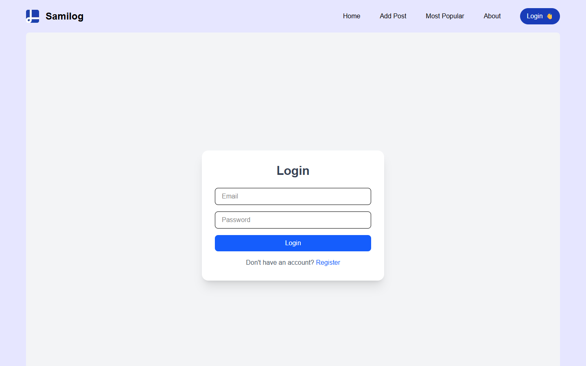
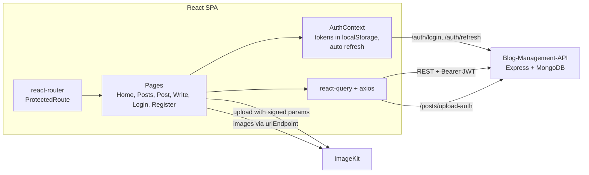

# Samilog: Blog Management Frontend

React 19 + Vite frontend for a multi-author blog. Users can register and log in with JWT auth, read published posts with infinite scroll, search and category filters, write posts in a rich-text editor with ImageKit media uploads, and comment.

Backend: [Sami123d/Blog-Management-API](https://github.com/Sami123d/Blog-Management-API) (Express + MongoDB).




## Status

Learning project. The UI layout follows a React blog tutorial: commented-out Clerk auth checks in `Write.jsx` and calls to endpoints like `/users/save` and `/posts/feature` are left over from it. I replaced the tutorial's auth with my own JWT backend.

Deployed on Vercel at https://blog-management-nine-neon.vercel.app. The login and register pages render, but signing in doesn't work yet: the API deployment is reachable but has no working database connection (its `/api` routes return 503). Every other page sits behind login.

## Features

Implemented:

- **Auth**: register and login pages that call `/api/auth/*`. The user and tokens are kept in `localStorage` through `AuthContext`, and access tokens refresh automatically in the background with the refresh token
- **Protected routes**: every page except login and register redirects to `/login` when you're not signed in
- **Home page**: category shortcuts, a "featured" block showing the 4 latest published posts, and a "Recent Posts" list with infinite scroll (`@tanstack/react-query` `useInfiniteQuery` and `react-infinite-scroll-component`)
- **Post list page** (`/posts`): search box (MongoDB text search on the API) and category filter through URL query params
- **Write page** (`/write`): title, category, description, rich-text content (`react-quill-new`), a required cover image, and inline image or video uploads straight to ImageKit (signed through the API's `/posts/upload-auth`). Posts are created as `published`
- **Single post page** (`/:slug`): renders the post HTML with author, date and category
- **Comments**: list and add comments, and delete them (comment author or admin)
- **Post actions**: delete a post (owner or admin). The navbar avatar menu shows an Admin badge for admins
- Toast notifications (`react-toastify`), relative dates (`timeago.js`), responsive navbar with a mobile menu

Not working yet (UI exists, backend support missing):

- **Save post** and **Feature post** buttons call `/users/save` and `/posts/feature`, which the API doesn't implement
- **Most Popular / Trending / sort** options set a `sort` query param that the API ignores, and there's no view counter
- The "About" link points to the home page

## Architecture



## Tech stack

React 19, Vite 7, React Router 7, TanStack Query 5, axios, Tailwind CSS 4, react-quill-new, @imagekit/react, react-toastify, react-icons, timeago.js.

## Project structure

```
src/
  main.jsx            Router, providers (Auth, React Query), toast container
  context/            AuthContext (user + tokens, auto refresh)
  routes/             Homepage, PostListPage, SinglePostPage, Write, LoginPage, RegisterPage
  components/         Navbar, FeaturedPosts, PostList, PostListItem, Comments, Upload, Search, SideMenu, ...
  layouts/            MainLayout
public/               Logo, icons, placeholder images
vercel.json           SPA rewrite so deep links like /register work on Vercel
```

## Environment variables

Create a `.env` file (these are exposed to the browser, so never put a private key here):

| Name | Purpose |
| --- | --- |
| `VITE_API_URL` | API base URL including `/api`, e.g. `http://localhost:5000/api` |
| `VITE_IK_URL_ENDPOINT` | ImageKit URL endpoint for rendering and uploading images |
| `VITE_IK_PUBLIC_KEY` | ImageKit public key for uploads |

## Getting started

```bash
npm install
npm run dev      # http://localhost:5173 (allowed by the API's CORS config)
npm run build    # production build in dist/
```

Run the [API](https://github.com/Sami123d/Blog-Management-API) locally on port 5000 as well, then set `VITE_API_URL=http://localhost:5000/api`.

## CI

GitHub Actions runs `npm ci` and `npm run build` on every push and pull request. ESLint is configured (`npm run lint`), but it currently reports existing errors, mostly `react-hooks` rules, so it isn't part of CI yet.

## Roadmap

- Implement save and feature endpoints on the API, or remove those buttons
- Real "most popular" sorting (view counts)
- Fix the ESLint errors and add lint to CI
- Move auth state fully into `AuthContext` (the navbar and a few pages still read `localStorage` directly)
